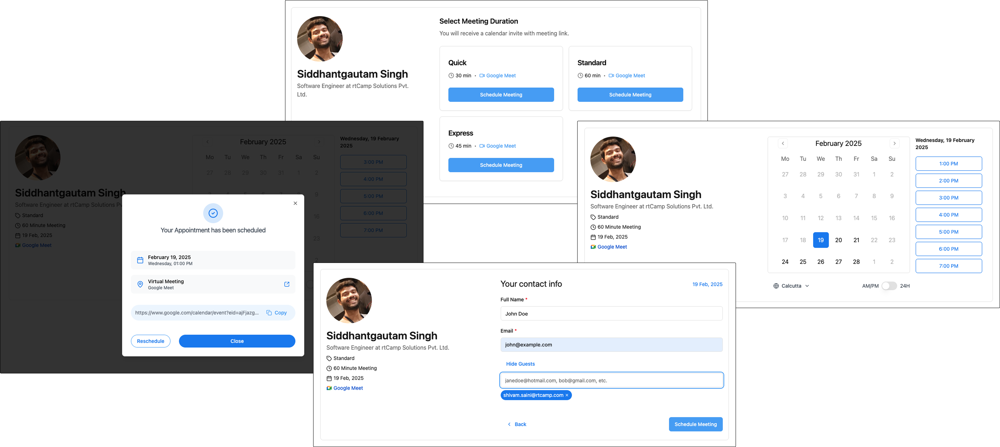

<div align="center">
  
  <h1>Appointment</h1>
  <p>A scheduling platform for solo professionals and organizations.</p>
</div>

<div align="center">
  
</div>

## About the product

Appointment helps service businesses configure what they offer, when and where
they are available, and how customers can book them. The product is being built
for individuals and organizations that need one place for public booking,
provider schedules, reception work, and the appointment lifecycle.

The current beta foundation supports:

- organizations, providers, services, and locations;
- provider availability and bookable time slots;
- public booking and confirmation;
- rescheduling and cancellation;
- reception workflows and walk-in assignment;
- English and Amharic presentation;
- Google Calendar, Google Meet, and Zoom integration inherited from the original
  scheduling foundation;
- a React application backed by Frappe Framework.

Most customers are intended to share one site with organization-level ownership
and permissions. Customers needing contractual isolation, regulated hosting,
unusual scale, data residency, or extensive customization may use dedicated
sites later. This architecture is being reassessed before the wider beta; see
[the product reassessment guide](docs/product-reassessment/README.md).

## Project status

Appointment is under active development and is not yet a stable production
release. The canonical app and Python package name is `appointment`, the display
name is **Appointment**, and the primary Frappe module is **Appointment**.

`develop` is the integration and default branch. `main` represents the same
release-ready baseline at the time of this repository housekeeping. New work
should branch from `develop` and return through review.

Known product work still includes validating the clean-start architecture,
simplifying the solo and organization experiences, defining the enterprise
boundary, and completing operational beta gates.

## Installation

Appointment requires a working Frappe Bench. From the bench directory:

```bash
bench get-app appointment https://github.com/MintesnotTsadiku/appointment.git --branch develop
bench --site <site-name> install-app appointment
bench --site <site-name> migrate
```

Build the frontend assets when they are not produced by your deployment flow:

```bash
bench build --app appointment
```

Use a development or test site before installing the current beta on an
important environment. Back up an existing site before installation or
migration.

## Local development

The repository contains a React/Vite frontend in `frontend/` and the Frappe app
in `appointment/`.

```bash
cd frontend
npm ci
npm run dev
```

Useful validation commands include:

```bash
cd frontend
npm run test:dom
npm run build

cd ..
bench --site <site-name> run-tests --module appointment.tests.test_app_identity
bench --site <site-name> run-tests --module appointment.tests.test_scheduling_workflows
```

Browser journeys are defined under `qa/manifests/` and run through Agent Plane
with Agent Harness as the browser execution layer. The current testing and
environment details are documented in
[the rename testing guide](docs/rename/testing-guide.md).

## Documentation

- [Product reassessment](docs/product-reassessment/README.md)
- [Current testing guide](docs/testing/CURRENT_TESTING_GUIDE.md)
- [Technical documentation](docs/technical/README.md)
- [Canonical rename and validation history](docs/rename/appointment-app-rename-implementation-plan.md)

Some older documents describe earlier product names, plans, or incomplete
experiments. Treat implementation claims in historical documents as context and
verify them against the current code and tests.

## Origins and ownership

This repository began as a fork of
[rtCamp/frappe-appointment](https://github.com/rtCamp/frappe-appointment) and has
since developed into a separate Appointment product. The repository history and
AGPL license preserve the original project's authorship and contributions. The
current product direction, implementation, operation, and maintenance are owned
by this repository's maintainer.

## Contributing

See [CONTRIBUTING.md](CONTRIBUTING.md). Please base proposed work on `develop`
and include evidence appropriate to the change.

## License

Appointment is licensed under the [GNU Affero General Public License v3](LICENSE).
