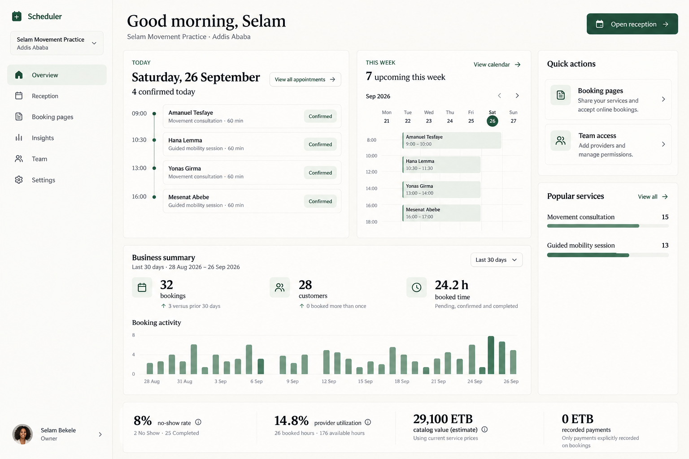

# Homepage and analytics implementation plan

Status: implemented in the isolated worktree. Final browser evidence and regression checks are in progress. Created 2026-09-26.

## Objective and approved decisions

Build a configurable homepage and Insights dashboard for independent providers and organizations.
Prepare filters, capture and calculations before designing widgets.
The user approved all proposed data additions. Larger dependencies are tracked separately in the [feature matrix](../Features/analytics-feature-matrix.md).

Use the configured branding, typography, colors and theme tokens as the source of truth.
Preserve APIs, permissions, existing functionality and untracked files.
Do not push, merge or deploy.

## Runtime

- Worktree: `/home/minte/projects/training-apps/.worktrees/frappe-appointment-beta`.
- Branch: `feat/content-publishing-gallery-onboarding`.
- Bench: `/home/minte/.local/state/frappe-worktree-stack/feat-content-publishing-galler-5839d4/bench`.
- Site: `meet-beta-feat-content-publishing-galler-5839d4.localhost`.
- React: `http://127.0.0.11:34340`.
- Internal backend: `http://127.0.0.1:34341`.

Reuse this runtime. Do not start a duplicate stack or modify the reference runtime.

## Visual reference

The selected reference is image 15, Light Workspace.
Use it for layout, hierarchy, spacing and content organization.
Its alternative branding and typography are incidental.

The original image is `/home/minte/projects/homepage-concepts/light-workspace.png`.
The repository copy keeps the acceptance target available to later implementers.

Borrow the attention queue from image 2, analytical grouping from image 14, and independent cards from image 12.
Borrow location/staff panels from image 5 and calculation explanations from the current homepage.
Avoid duplicate agenda/calendar displays in the default preset.
Generate a final composite after data contracts and widget choices are ready, before layout implementation.
Keep that composite alongside this reference and compare both with browser captures.

## Repository evidence and limitations

- `appointment/scheduler/analytics.py` provides permission-scoped analytics and CSV export.
- `frontend/src/components/analytics/WorkspaceDashboard.tsx` renders the current analytics.
- `frontend/src/components/workspace/AppTopNav.tsx` provides role-aware top navigation.
- Appointment records contain scheduled times, status, customer contacts, cancellation reason and `amount_paid`.
- Walk-in records contain creation time, status and assigned appointment links.
- Newsletter audience records contain consent, confirmation and unsubscribe timestamps.
- Newsletter campaigns contain status and captured/skipped/retry counters.

These findings come from code inspection, not verified populated site data.
Verify migrations, installed schemas and actual write paths before implementing each metric.
Do not use Frappe `modified` as a confirmation, cancellation, payment or arrival timestamp.
Existing change history can help investigations. It is not the new analytics event contract.

Current limitations:

- Customer aggregates use email identity within the period.
- Historical utilization uses current schedules, holidays and assignments.
- Catalog value uses current service prices.
- Payment totals have no reliable payment-date ledger.
- The heatmap counts appointment start times, although current presentation calls them booked hours.
- Newsletter delivery uses a local email sink.
- Current ranked aggregates truncate services to six and providers/locations to eight.

## Phase 1: Filters and small data capture

Deliver filter contracts and workflow capture first. Do not wait for widget design.

### Shared filters

| Filter | Required behavior |
| --- | --- |
| Business | Use the selected workspace. Enforce ownership and role scope on the server. |
| Date range | Presets today, 7, 30 and 90 days, plus validated custom dates. |
| Time basis | Label appointment date, booking creation date, outcome date or event date explicitly. |
| Comparison | Previous equivalent period. Add matching weekday comparison where useful. |
| Timezone | Default to business timezone. State the timezone in charts and exports. |
| Provider and location | Support one, several or all permitted records. |
| Service | Support one, several or all eligible services. |
| Status | Support outcomes without changing each metric's declared denominator silently. |
| Booking source | Online, staff/reception, walk-in, import and unknown. |
| Customer segment | New, returning and repeat-within-period with documented definitions. |
| Granularity | Daily, weekly or monthly, based on range and chart width. |

Apply supported filters consistently to widgets, drill-downs and CSV exports.
Today and upcoming operational cards use explicit relative windows, independent of historical reporting dates.
Show those local windows. Do not imply that a historical filter changes today's agenda.
Reject unauthorized filter IDs on the server.

### Capture contracts

| Capture | Required data | Write path and acceptance |
| --- | --- | --- |
| Agreed booking price | Price, currency, discount amount/code, price basis and snapshot time | Capture when booking terms become final. Later catalog changes must not rewrite it. |
| Booking source and referral | Source enum, optional referral code/source, actor | Capture online, reception, walk-in and import paths. Preserve unknown for older bookings. |
| Booking lifecycle events | Booking ID, event type, UTC timestamp, actor, source, previous/new status, idempotency key | Capture create, confirm, cancel, complete and no-show in shared mutation paths. |
| Reschedule events | Original/new interval, provider/location changes, actor, reason | Retain the old schedule. Capture successful committed changes only. |
| Confirmation and cancellation timing | Confirmed/cancelled timestamp and initiator | Derive from lifecycle events or update explicit fields consistently. |
| Arrival and service events | Arrival, check-in, assignment, actual start and actual end | Keep reception stages separate from appointment outcome statuses. |
| Walk-in assignment events | Walk-in ID, assignment time and booking link | Support current wait and historical queue wait calculations. |
| Slot recovery links | Cancelled booking/released interval and replacement booking | Distinguish verified recovery from a later overlapping booking. |
| Reception state | Business/location, open/closed state, actor and effective time | Define behavior when reception has never been configured. |
| Action activity | Entity, action, timestamp and authorized actor | Build attention resolution and recent activity without exposing private content. |
| Data freshness | Data source, generated time and source watermark when available | Show freshness and distinguish stale from empty data. |

Store workflow events within the booking transaction or through a reliable outbox.
Retries must not duplicate events. Failed mutations must not create successful lifecycle events.
Use UTC for timestamps and business timezone for reporting boundaries.
Do not infer unknown old capture values. Return coverage dates and unknown counts.
Design Frappe schema changes through supported DocTypes and explicit site migrations.
Historical availability snapshots are approved but remain the separate LF-09 feature.

## Phase 2: Metric contracts and data preparation

Give every metric a stable ID before creating its widget.
Define source records, time basis, eligible statuses, formula, denominator, unit, filters and permission scope.
Include comparison rules, freshness, coverage and drill-down behavior.
Return zero only when complete eligible data produces zero.
Return unavailable when the denominator or capture is missing.
Return partial coverage when records only support part of the selected range.

### Complete metric inventory for this delivery

`Existing` means the API already calculates the metric.
`Calculate` means existing records support a calculation or query.
`Capture` means Phase 1 records are required.
Names below are separate metric contracts, even when one widget displays several.

| Group | Existing metrics | New calculations | Metrics after small capture |
| --- | --- | --- | --- |
| Booking totals | Confirmed today, upcoming seven days, total, active, completed, cancelled, no-show count | Pending confirmation, status distribution, completed today, unresolved past appointments | Source totals, source mix, referral totals |
| Booking outcomes | No-show rate | Completion rate, cancellation rate, attendance rate, cancellation reason distribution | Reschedule count/rate, changes per booking, initiator breakdown, late cancellation rate |
| Booking trends | Daily counts, grouped weekly counts, selected previous-period comparisons | Creation-date trend, monthly trend, all supported metric comparisons, weekday/hour booking-creation demand | Confirmation/cancellation/reschedule event trends |
| Booking timing | Booked scheduled hours | Average duration, duration distribution, booking lead time and distribution | Confirmation turnaround, cancellation notice, actual duration, delay and overrun |
| Customers | Unique customers and repeat customers within period | Repeat percentage, new/returning counts, bookings per customer, days since last completed visit, visit intervals | Referral conversion after source capture |
| Retention | None | First-to-second visit conversion, 30/60/90-day retention, cohort matrix, rule-based lapse risk | None beyond agreed captures |
| Customer behavior | None | Service/provider/location preferences, customer cancellation/no-show frequency, booking concentration, recorded-payment concentration, recorded payments per customer | None beyond agreed captures |
| Customer data quality | None | Missing contacts, likely duplicates, unmatched records | Better capture completeness checks |
| Capacity | Occupied hours, available hours, utilization | Provider/location/service utilization, unused hours, future available slots, next available slot | Accurate historical capacity waits for LF-09 |
| Demand and schedules | Appointment-start popularity heatmap | Occupied-hour heatmap, peak/off-peak counts, capacity-adjusted popularity, schedule gaps, fragmentation, buffer hours/share | Verified slot recovery count/rate |
| Availability quality | None | Missing staff availability, no-availability days/hours, overlapping booking conflicts, workload distribution | Availability issue resolution time from action events |
| Services | Top service bookings | Service share/trend, booked hours, average scheduled duration, completion/cancellation/no-show rates, repeat usage | Actual service duration |
| Providers and locations | Provider and location booking rankings | Comparative bookings/hours/outcomes, active records, opening hours, today's workload | Arrival/delay/actual duration comparisons |
| Team and setup | None | Pending/accepted invitations, service catalog completeness, setup completeness | Invitation/action turnaround where capture supports it |
| Booking value | Current-price catalog estimate, recorded payment total | Estimated value by service/provider/location, average estimate, future scheduled estimate, estimated cancellation/no-show loss | Original agreed value, discounts and promotional usage |
| Payment completeness | None | Count of bookings/customers with recorded payment, missing recorded amounts | Capture quality for agreed charges. Reliable balances wait for LF-02. |
| Reception | None in analytics API | Agenda, next appointment, walk-ins waiting/assigned/cancelled, current walk-in wait, walk-in-to-booking conversion | Reception state, arrivals, checked-in count, arrival punctuality, average queue wait, service delay |
| Attention and activity | None in analytics API | Pending imports, unresolved bookings, conflicts, incomplete availability, missing client/payment fields | Recent actions, resolution turnaround |
| Website and content | None in analytics API | Published status, setup checklist, published/draft counts per supported content type, gallery counts/completeness | Publication/action activity when captured |
| Newsletter | None in analytics API | Audience status counts, growth/unsubscribe trend, confirmation rate/time, campaign status counts, local captured/skipped/retry counts, scheduled campaigns, sender readiness | None. Real delivery and engagement remain LF-16/LF-17. |
| System and quality | None in analytics API | Publishing/import/campaign errors, missing service price/duration/availability, unresolved appointment status | Analytics freshness and event coverage |

The [feature matrix](../Features/analytics-feature-matrix.md) contains every larger dependency from the review.
Do not treat its metrics as implemented by this phase.

### Definition decisions

- Keep cancellation and no-show outcomes separate.
- Label scheduled duration separately from occupied capacity including buffers.
- Keep appointment-date counts separate from booking-creation and outcome-event counts.
- New customers have no earlier eligible booking in the same business.
- Returning customers have an earlier eligible booking outside the selected period.
- Repeat-within-period customers have more than one eligible booking inside the period.
- Retention requires an equal observation window. Exclude cohorts that have not completed that window.
- Use email-based identity provisionally and disclose its limitations. Reliable identity depends on LF-01.
- Label current-price estimates separately from original agreed booking value and collected payments.
- Explain numerator, denominator, excluded statuses and time window for each rate.
- Use top-N plus Other or a full paginated ranking. Do not present truncated ranks as complete totals.

Extend existing permission-scoped APIs rather than duplicating analytics logic in React.
Aggregate on the server and inspect query counts, indexes and payload sizes with realistic records.
Keep financial access limited to existing authorized capabilities.

## Phase 3: Widget registry and chart selection

Build widgets after their metric contracts pass data checks.
Each registry entry declares metric IDs, filters, industry tags, permission requirements and data dependencies.
Declare supported chart types, minimum sizes, loading/empty/error states and drill-down links.

| Data shape | Default presentation | Other suitable presentations |
| --- | --- | --- |
| Single value and change | KPI card with comparison | Sparkline or small radial indicator for bounded rates |
| Counts over time | Bar chart | Line chart. Area chart for continuous aggregate trends. |
| Rates over time | Line chart | Line with numerator/denominator tooltip |
| Category rankings | Horizontal bars | Table for exact values |
| Status/source/service shares | Stacked bar | Pie/donut for a few mutually exclusive categories totaling the whole |
| Utilization | KPI and capacity bar | Radial chart with an explicit denominator |
| Popular times | Weekday/hour heatmap | Grouped bars for selected days |
| Retention | Cohort heatmap | Retention curve |
| Lead time, duration or delay | Histogram | Percentile summary and box plot if supported |
| Comparable multidimensional profiles | Radar chart | Grouped bars. Normalize scales and explain each dimension. |
| Agenda and attention | List or table | Calendar preview or reception board |

Use familiar chart types when they fit the question. Do not force every chart type into the default dashboard.
Avoid radar charts with unrelated units or unclear scoring.
Do not smooth integer booking counts into misleading curves.
Tooltips show date/category, value, unit, comparison and relevant denominators.
Support focus and touch. Provide accessible summaries and a table alternative for charts.
Choose a chart library after checking existing frontend dependencies. Record the choice and bundle impact.
All chart styling must use configured theme tokens.

## Phase 4: Configurable dashboards and industry presets

Persist Home and Insights configurations separately, per user and business workspace.
Store a versioned schema with widget IDs, chart types, positions, size spans and local filter overrides.
Validate configurations against the registry and the user's current permissions.

Required controls:

- Add widget with search, category and industry filters.
- Reorder, resize, remove and change supported presentation.
- Keyboard alternatives to drag and resize.
- Save, cancel customization and reset to preset.
- Independent Home and Insights configurations.
- Restore safe defaults for unknown or retired widget IDs.
- Preserve existing customization when applying a preset unless the user chooses replacement.

Small widgets show values and comparisons. Larger sizes reveal charts, breakdowns and tables.
Reflow widgets on mobile without changing saved desktop positions.
Do not shrink chart labels below readable sizes. Use tables or scrolling for wide heatmaps.

### Industry presets

| Preset | Default Home | Default Insights |
| --- | --- | --- |
| General business | Agenda, attention, upcoming, quick actions | Booking trend, outcomes, customers, capacity, services, booking value |
| Clinic | Agenda, arrivals, delays, unresolved bookings | Attendance, no-shows, utilization, return visits, service demand |
| Freelancer | Next appointment, weekly agenda, availability, quick actions | Booked hours, lead time, new/returning customers, agreed value |
| Consultant | Upcoming sessions, follow-up attention, schedule gaps | Repeat visits, booking lead time, service mix, hours and agreed value |
| Hairstylist | Today's agenda, arrivals, staff workload, gaps | Service popularity, repeat visits, duration, no-shows, discounts, agreed value |
| Organization | Location workload, team availability, conflicts | Provider/location comparisons, capacity and service mix |
| Reception | Agenda, walk-ins, arrivals, checked-in state | Daily flow, queue wait, delays, unresolved outcomes |
| All | All implemented and permitted widgets, grouped by category | All implemented and permitted analytics, grouped by category |

Presets select useful views. They do not introduce clinical outcomes or industry-specific records that do not exist.
The All option displays all eligible widgets. Use grouped rendering and pagination or virtualization to keep it usable.
Show future feature dependencies in catalog documentation rather than fabricated live cards.
Allow users to select several categories or industries.
Keep role permissions authoritative even when a preset requests restricted widgets.

## Phase 5: Homepage layout and navigation

Use the selected image's agenda-first hierarchy with business metrics below and quick actions nearby.
Replace its duplicated calendar with a selectable Agenda or Calendar widget.
Make service rankings fit their content instead of occupying an empty tall column.
Keep attention items above secondary analytics when actionable issues exist.

Add a per-user navigation preference under Settings:

- Top navigation with compact horizontal links.
- Left sidebar with expandable icon-and-label navigation.
- Collapsed left sidebar shows icons only, tooltips and accessible names.
- Persist collapse state and support a permanently collapsed preference.
- On mobile, use an accessible drawer and preserve content width.

Both modes use the same route definitions, active-route rules and role gates.
Preserve business switching, profile, theme controls and logout.
Support independent owners, organization roles and administrator routes.
Use visible focus, adequate touch targets and predictable keyboard order.
Do not introduce new branding or theme tokens without an existing-token gap analysis.

## Phase 6: Validation and evidence

### Data acceptance

- Verify schema and write paths in the specified isolated site.
- Test authorization for owner, manager, provider and receptionist scopes.
- Test cross-business and restricted filter rejection.
- Test empty periods, unavailable denominators, partial capture and timezone boundaries.
- Test price changes, buffers, overlapping allocations and cancelled/no-show separation.
- Test retries, transaction failures, event uniqueness and reschedule history.
- Test customer cohort eligibility and same-business identity boundaries.
- Reconcile chart buckets and ranking shares with their declared totals.
- Verify filtered exports match the displayed data and preserve CSV safety.
- Measure representative query and response costs.

### UI acceptance

Validate in the managed browser using the existing runtime.
Cover desktop and mobile in light and dark modes, for both navigation placements.
Cover expanded/collapsed sidebar, industry presets, All, empty data and populated data.
Verify adding, removing, resizing, reordering, saving and restoring widgets.
Verify keyboard/touch behavior, chart tooltips, filters, drill-downs and configuration persistence.
Check role changes, workspace switching and unavailable feature behavior.
Check existing booking, settings, publishing and reception flows for regressions.

Store browser evidence under `qa/evidence/homepage-analytics/`.
Capture the final interface alongside the selected image and later composite.
Compare hierarchy, spacing, density and responsiveness. Theme differences from the reference are expected.
Do not claim visual completion from code inspection or a generated image alone.

## Delivery checkpoints

1. Confirm installed schemas and finalize metric/filter contracts.
2. Implement Phase 1 filters and small capture, with focused data tests.
3. Implement calculations, scoped APIs, coverage metadata and exports.
4. Verify data before selecting final widget presentations.
5. Build registry, dashboard persistence and industry presets.
6. Generate and review the final composite using the configured theme.
7. Implement the selected layout and both navigation options.
8. Complete browser validation and record evidence.

Track larger features through their LF IDs. Deliver them through separate implementation scopes.

## Implementation progress — 2026-09-26

The implementation uses the specified worktree, Bench, site, and React runtime.
No reference runtime changes, push, merge, or deployment are part of this delivery.

| Checkpoint | State | Evidence |
| --- | --- | --- |
| Installed schemas and write paths | Complete | Appointment, Walk In, Location, invitations, content releases, and newsletter schemas inspected |
| Shared filters and small capture | Complete | UTC workflow ledger, immutable price/source snapshots, reception stages/state, assignment timestamps, validated recovery links |
| Calculations and authorization | Complete, with declared coverage limits | Permission-scoped contracts, exports, matching record pages, five-role checks, reconciliation tests |
| Registry and preferences | Complete | Home and Insights saved separately per user/business; presets, All, search, order, size, charts, local filters |
| Composite and layout | Complete | `../design-references/homepage/final-composite.png`; native React layout uses application theme tokens |
| Navigation | Complete | Shared top/sidebar routes, collapse preferences, keyboard controls, mobile drawer |
| Browser acceptance | Complete | Final organization run BQA-2026-00208, independent run BQA-2026-00201 and publishing regression BQA-2026-00204 passed; screenshots and comparison evidence saved |

### Data limits retained in the interface

- Historical agreed prices, sources, and workflow timestamps remain unknown. The implementation does not backfill them.
- Current catalog estimates, original agreed snapshots, and recorded amounts have separate contracts.
- Default zero recorded amounts cannot distinguish missing entries from unpaid bookings. Reliable balances remain LF-02.
- Current schedule estimates disclose LF-09. Missing historical occupied intervals are excluded, rather than rebuilt from current buffers.
- Future slot counts represent offering choices. Several service choices can share the same capacity.
- Customer identity uses same-business email. Duplicate candidates do not merge customers. Reliable customer identity remains LF-01.
- Referral totals do not establish visitor conversion or campaign ROI. Those denominators remain LF-05/LF-06.
- Newsletter counters describe local captures. They do not establish inbox delivery or engagement. These remain LF-16/LF-17.
- Workbook import records contain successful committed results. Pending and failed attempts have no persisted lifecycle and show unavailable coverage.
- Publishing errors have no persisted business-scoped error lifecycle. The widget shows unavailable coverage.
- Overdue booking resolution uses committed outcome timestamps. It does not claim availability or setup issue resolution.

### Validation progress

Focused capture checks verify immutable snapshots, retry uniqueness, reschedule history, and failed-write rollback.
Analytics checks verify scoped filters, denominators, record projections, ranking totals, separate preferences, and financial permissions.
Independent booking checks cover ownership, foreign access rejection, publishing, guest booking, retries, and shared capacity.
Frontend DOM checks and focused lint pass. Production assets build into `/tmp`, without replacing runtime assets.
The full TypeScript check has existing errors in unrelated availability, task, calendar, and settings modules.
Changed analytics and navigation files are checked separately in the diagnostics.

A 90-day owner report over 318 bookings measured 145 SQL queries and approximately 0.37 seconds.
The response contains aggregate contracts and permission-scoped references. Private contact fields are excluded from exports and record tables.

### Completed acceptance work

The final managed browser run passed, including reception stages/state, mobile customization, permissions, exports, and workspace switching.
The registry contains 176 implemented metric contracts. All shows every widget permitted for the current user, with pagination.
Saved screenshots, validation summaries and visual comparison are available in `qa/evidence/homepage-analytics/README.md` and `comparison.html`.
The focused backend and frontend checks pass. The unrelated full TypeScript failures remain documented in the evidence report.
The larger-feature dependencies above remain separate delivery scopes. No push, merge or deployment was performed.

## Follow-up: reference composition and complete demo scenarios

The user's actual Selam screenshot showed that the first generic widget composition did not match the reference closely enough.
The default general Home now groups the timeline, seven-day preview, popular services, business summary/chart and indicator strip in the reference hierarchy.
The seeder now supplies capture and mature-cohort scenarios across all ten fictional providers, plus 30 walk-ins and 15 first-use Insights configurations.
Imported original prices and unsupported dependencies remain unknown. User-created records, browser actions and saved dashboards are preserved.
See `docs/implementation/homepage-demo-data.md` for seed ownership, coverage and date-range details.
Revised organization acceptance BQA-2026-00212 and seeded-business acceptance BQA-2026-00213 passed. The reference/before/after viewer and 25 demo screenshots are saved under `qa/evidence/homepage-analytics/`. Independent composition regression BQA-2026-00214 passed. Focused checks also verify seed idempotency, mature cohort totals and preservation of user-entered recorded amounts during later seed upgrades. All follow-up acceptance work is complete.

### Follow-up: workspace controls and dashboard discovery

Shared theme-based controls now style workspace date fields, checkboxes, selects and popovers. Public templates retain independent styling. Calendar selection follows the configured accent. Controlled date clearing and checkbox callback forwarding are corrected.
Browse widgets and Appearance are visible on Home and Insights. Each dashboard explains its separate saved layout. Appearance offers explicit Light, Dark and Match device choices with navigation preferences.
Focused lint and isolated Vite build pass. Managed homepage regression: BQA-2026-00215.
Native select popup surfaces remain browser-owned. Shared calendar popups supplement native date entry, and Radix select/popover surfaces are themed centrally. The control inventory records the audited callers. Appearance/library and booking interactions are covered by the browser runs below.

Control follow-up validation: expanded homepage BQA-2026-00216 passed. Independent BQA-2026-00222 passed calendar selection against the controlled booking form, required-date preservation, booking confirmation and desktop/mobile light/dark checks. Shared Input date callers now use the same calendar popup; raw assistant/reception date fields migrated to shared Input. The native input stays registered for keyboard editing, form validation and min/max enforcement. Calendar days use 44px targets and the configured accent. Control inventory and evidence: `qa/evidence/homepage-analytics/controls/`.
Native select menus intentionally retain OS keyboard behavior; their workspace field styling is centralized. Radix popup surfaces are themed centrally. Arbitrary palette/font editing is not added: configured platform tokens remain authoritative.
Publishing run BQA-2026-00217 reached an obsolete Home business-name heading assertion. The assertion now checks the business subtitle; corrected rerun BQA-2026-00223 passed. The earlier reception optimistic-lock failure was not repeated in BQA-2026-00216. Required-date reselect failure BQA-2026-00221 was corrected before the passing independent run.

Final homepage control acceptance BQA-2026-00227 passed, including category checkbox filtering. Final Appearance/calendar/library screenshots were inspected and saved. Independent booking BQA-2026-00222 and publishing BQA-2026-00223 passed. The centralized control styling and discovery follow-up is complete with the native-select popup and code-owned palette limitations documented above. No push, merge or deployment.
