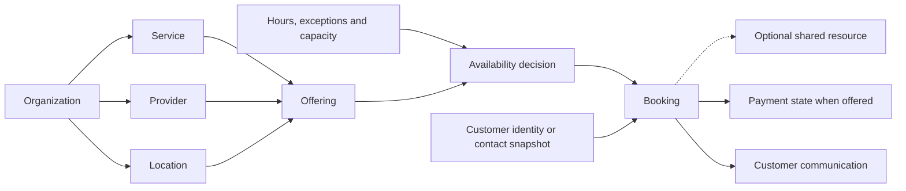

# Phase 1 — Product promise and domain model

Source baseline: `7e233e6cf240f57201a3b39b6b8279d10b0d599f`.
This is a product/domain assessment, not a certification of completed workflows.
Evidence and runtime qualifications are in [evidence-index.md](evidence-index.md).

## Product direction

Appointment should serve solo professionals through organizations on a shared
site, revealing complexity gradually. Shared-site safety remains an assumption
for Phase 2 to test. A solo professional or small one-location business is a
reasonable first beta audience, but the owner has not narrowed the target market
or committed to excluding organization workflows.

The complete job is to define a service and availability, publish a booking
link, receive a confirmed booking, and manage rescheduling, cancellation,
completion and no-shows with clear customer communication. This phase did not
execute that lifecycle. Existing source, tests and schemas support parts of it.

**Product-owner direction:** keep the aspirational marketing promises during
prelaunch development. Missing capabilities become delivery requirements in
[marketing-delivery-requirements.md](marketing-delivery-requirements.md), not
instructions to remove copy. Before inviting actual customers, verify the
promises offered to them. Aspirational capabilities and factual claims about
customers, partners or uptime require different evidence.

## Promise coverage

“Source-supported” means inspected code or test definitions, not a passing test
run. Absence of a dedicated DocType alone does not establish absent behavior.

| Promise | Evidence | Assessment and remaining check |
|---|---|---|
| Scheduling, buffers, availability | `appointment/scheduler/availability.py:21-68`; `appointment/scheduler/helpers/slot_engine.py:258`; Service buffer fields | Source-supported intersection of location/service/provider hours; public/personal/reception consistency unverified. |
| Public booking and confirmation | `appointment/api/personal_meet.py:457`; `qa/manifests/appointment_scheduling_smoke.yaml:134`; booking screenshot | First screen observed. The unit test at `appointment/tests/test_scheduling_workflows.py:216` checks catalog visibility only. Confirmation lifecycle unverified. |
| Local and international payments | `frontend/src/lib/i18n/translations/en.json:52-56`; `appointment/onboarding.py:863-871`; `appointment/payments/__init__.py` | Payment onboarding is a placeholder; no collection integration identified in reviewed app. Policy calculations and amount-paid fields do not establish payment processing. |
| Web, SMS, USSD, WhatsApp booking | `en.json:57-61`; `appointment/channels/__init__.py`; public booking screen | Web surface exists; listed non-web booking implementations not evidenced. Share links are not booking integrations. |
| Teams and locations | Organization/Provider/Location schemas; `frontend/src/pages/settings/team.tsx:317,351,391` | Models exist; team UI includes Coming Soon. Organization lifecycle unverified. |
| Customer profiles, history, follow-ups | `en.json:67-71`; `appointment/scheduler/doctype/appointment/appointment.json:77-95`; Walk In contact fields | Contact snapshots exist; dedicated Customer model not evidenced. Actual customer-management workflow unverified. |
| Analytics | `frontend/src/pages/analytics/index.tsx:14-20`; `appointment/dashboard.py:9-109` | Analytics page has static values; dashboard has real calculations. Partial implementation, not universal absence. |
| English, Amharic and local time presentation | Translation resources; booking screenshot | Language resources and time-format controls exist. Full translated journeys unverified. |
| Google Calendar, Google Meet, Zoom | `appointment/helpers/google_calendar.py`; `appointment/helpers/zoom.py`; `frontend/src/pages/settings/calendar.tsx:183-196` | Backend helpers exist; settings connection control lacks a handler. Connection, sync and recovery unverified. |
| Reception, walk-ins and appointment status changes | `appointment/scheduler/api/desk.py`; `appointment/tests/test_scheduling_workflows.py:149-214` | Source/test coverage exists; no role-specific journey executed here. |

Rendered branding is Meet.et while the canonical product identity is Appointment.
The intended relationship needs an owner decision; a technical app name alone
does not decide the customer-facing brand.

## Current domain

| Concept | Current representation | Interpretation / unresolved issue |
|---|---|---|
| Organization | `appointment/appointment/doctype/organization/organization.json` | Business ownership and management; tenant isolation needs verification. |
| Provider | `appointment/scheduler/doctype/provider/provider.json` | Service delivery person; current organizations table and deprecated organization link coexist. Compatibility and access effects need checking. |
| Customer | Appointment and Walk In contact snapshots | Stable organization-scoped identity may help repeat customers. Neither missing history nor the need for a new model is proven. |
| Service | `appointment/scheduler/doctype/service/service.json` | What is offered: duration, price, buffers, provider links. |
| Bookable offering / EventType | `appointment/scheduler/doctype/eventtype/eventtype.json:38-99` | Binds service/provider/location with price/duration overrides. This can be a legitimate responsibility, not simply a duplicate Service. |
| Location | `appointment/scheduler/doctype/location/location.json` | Place, timezone and opening hours. Repeated metadata field names need inspection. |
| Resource | No dedicated model identified | Relevant when shared rooms/equipment constrain capacity, not mandatory for every salon or clinic. |
| Availability | Provider/Service/Location hours; personal availability and Appointment Group paths | Multiple constraints are reasonable. A hierarchy already intersects location/service/provider hours. Cross-path consistency is unverified. |
| Appointment | Scheduler Appointment with lifecycle statuses | Visit management record with service/provider/location and optional event link. |
| Event | Booking Event and Appointment Group | Public/calendar flow uses Booking Event. Slot engine checks both record types; lifecycle ownership and synchronization need tracing. |
| Walk-in | Walk In with assigned appointment link | Unscheduled arrival and reception handoff; preserve this concept. |
| Payment | Amount-paid field and Policy calculations | Money state and policy are not a verified transaction/receipt system. |
| Communication channel | Email templates and calendar/meeting helpers; channels package | Customer communication and booking intake are distinct concerns. Delivery/retry behavior is unverified. |

## Clean-start comparison

This is a conceptual model, not an approved schema or refactoring plan.

A clean design gives each booking a clear lifecycle owner and combines relevant
constraints in one decision contract. It need not store all availability in one
place or remove a useful offering entity. Solo setup should hide unnecessary
organization/provider configuration; this has not been tested yet.

| Current choice | Clean-start preference | Least expensive safe next step |
|---|---|---|
| Contact snapshots | Scoped identity when repeat-customer needs justify it; retain booking snapshots | Test needs before adding Customer. Define matching and ownership; do not merge people automatically by name/email/phone. |
| EventType binding and overrides | Clear internal offering, understandable customer service labels | Preserve responsibilities; friendly URLs are independent of schema collapse. |
| Several availability paths | One final decision contract with layered constraints | Trace existing calculators and consumers in Phase 2 before consolidation. |
| Appointment and Booking Event | Explicit lifecycle ownership and calendar projection | Verify synchronization and conflicts; two record types alone do not prove a defect. |
| Missing integrations | Separate payment and communication responsibilities | Deliver advertised capabilities incrementally with failure/retry checks. |

No rewrite is justified by this evidence. No comparative rewrite cost has been
established, and working behavior should be preserved while gaps are validated.

## Five decisive findings

| Finding | Why it matters | Evidence | Action | Timing |
|---|---|---|---|---|
| F1. Marketing describes capabilities beyond demonstrated implementation. | Defines delivery work and launch acceptance, rather than proving current readiness. | Promise table; `marketing-delivery-requirements.md` | Keep aspirations; implement and verify gaps | Before customer launch for promises offered |
| F2. A 30-minute fixture is displayed as “0.5 min”. | Customers need a trustworthy duration at booking. Saved booking duration was not checked. | Booking screenshot; `appointment/qa_fixtures.py:190-198`; `frontend/src/pages/organization-appointment/index.tsx:241` divides duration by 60 | Improve now in a separate implementation task | Before beta |
| F3. Availability and booking lifecycle consistency across paths is unverified. | Different intake paths must respect the same capacity and lifecycle rules. | `availability.py:21-68`; `slot_engine.py:68-115,258`; public and reception APIs | Keep existing mechanisms; verify before prescribing change | Phase 2, before beta |
| F4. Legacy organization fields and front-desk role spellings coexist. | They may be compatibility details or affect access. Harm and safe deferral are not established. | Provider schema; role fixture versus Appointment DocPerm; both role names present on QA site | Verify access effects; defer cosmetic cleanup only if safe | Phase 2, before beta safety decision |
| F5. Service and Location schemas repeat field names. | Metadata interpretation can be ambiguous; repeated definitions are not separate database columns. | Service: buffer_before/after; Location: address_line_1/2, city, phone, timezone repeated in JSON | Improve after checking metadata/runtime/migration effects | Before beta impact assessment; fix timing depends on impact |

## Strengths to preserve

- Appointment lifecycle statuses and the Walk In assignment concept (schema evidence).
- Service duration, price, buffers and provider overrides (schema evidence).
- Organization booking configuration, assignment policies and branding (schema evidence).
- Existing availability intersection, cross-record conflict checks and Policy calculations (source evidence).
- English/Amharic resources and selectable time presentation (source and screenshot evidence).

These are assets, not a claim that every associated journey passes.

## Industry fit and scope

All fit judgments are inferences, not validated deployments. Solo consultants
fit the basic service/time model. Salons may need shared capacity and deposits;
clinics may need rooms and stable customer identity without Appointment becoming
a clinical-record system. Repair services may need asset references and travel
constraints; fixed buffers do not solve route-dependent travel. Classes need
attendee/capacity behavior. Public offices need queues and possibly counter
capacity. Three added entities cannot be assumed to solve every industry.

Dedicated enterprise deployment, industry-specific records and advanced CRM are
reasonable candidates for later scope, subject to actual promises and customer
needs. Shared-site tenant isolation is not deferrable. Resource/class behavior is
conditional on the selected beta workflow. Payments and advertised channels are
delivery gaps, not blanket exclusions approved by this phase. Phase 6 must
establish minimum recovery, reporting and export obligations.

## Five decisions needed

1. Which first customer and complete workflow define beta acceptance?
2. Which advertised capabilities must be ready for the first actual customer launch?
3. Does that workflow need stable Customer identity, and with what organization scope and matching rules?
4. What owns the final availability decision and booking lifecycle across existing paths? Retain EventType responsibilities until this is understood.
5. Is Meet.et intended customer branding, or should it align with Appointment?

## Evidence limits

Only homepage desktop/mobile and the public booking first screen were observed.
No completed booking, payment or authenticated role lifecycle was tested in this
phase. Referenced tests were read, not executed. Historical capture used
`auth: none`, not required `frappe_session`, and produced no video. Preserve the
artifacts as static page evidence; they do not certify protocol compliance.
Runtime and artifact retention details are in the evidence index. Later QA
account setup is documented separately in `../browser-qa-access.md`.
