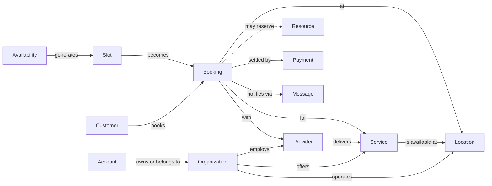

# Phase 1 — Product promise and domain model

Status: assessment only. No product code, schema, dependency, or runtime
configuration was changed. This phase does not complete the Phase 2 security and
architecture assessment.

Reviewed baseline: `origin/develop` = `7e233e6cf240f57201a3b39b6b8279d10b0d599f`
(`docs: establish Appointment repository identity`). Evidence folder:
`docs/product-reassessment/phase-01-product-and-domain/`.

Runtime used for browser evidence: preserved isolated runtime
`fix-appointment-beta-readiness-01dea7`, site
`meet-beta-fix-appointment-beta-readiness-01dea7.localhost`, frontend
`http://localhost:49510`. Declared runtime source
`fix/appointment-beta-readiness @ 3c57fb4c6484218c41af6ee592de0960c1c69ad6`
(clean). Browser QA Run `BQA-2026-00060`. See `evidence-index.md` for the
runtime-revision caveat (the bench also loads the app from the clean
`develop @ 7e233e6` beta worktree; product trees are identical between the two
commits).

Labels used below: **Observed** (I executed or read it in this phase),
**Read** (source inspection), **Inference** (reasoning from observed facts),
**Unverified** (could not establish).

---

## 1. Who the product should serve first, and the complete job

**Recommendation (not an agreed decision).** The first beta customer should be a
solo professional or a small one-location business with one to a few providers.
Their complete job is one appointment lifecycle:

> Say what I offer (service, duration, price), say when I am available (weekly
> hours plus exceptions), publish one bookable link, let a customer self-book a
> real confirmed time, then see that appointment, reschedule, cancel, complete,
> or mark a no-show it — with a reminder, and without me learning Frappe,
> organizations, providers, or permissions.

**Why this ordering.** The homepage and README advertise a much larger product
(payments, SMS/USSD/WhatsApp, customer management, analytics, teams). The
implemented core is the solo/appointment lifecycle. Serving the smaller,
complete job first is the cheapest path to a trustworthy beta; organization
structure should appear only when it is needed and understandable.

**Already agreed vs recommendation.** The reassessment README and repository
README set the *aspiration* to serve solo users through large organizations on
one shared site, and that direction is an explicit assumption to test, not a
conclusion. No reviewed artifact records an explicit, dated decision naming the
*first* beta customer or the minimum complete job. The paragraph above is my
recommendation for the product owner to accept or reject (Decision D4).

---

## 2. Promise-to-evidence table

Promises are taken from the rendered public homepage (Observed) and its
translation source. Status: Implemented / Partial / Absent. "Executed" means I
ran it in this phase, not merely read a test.

| # | Homepage promise | Advertised at | Code / tests that support it | Executed or observed | Status | Remaining unverified |
|---|---|---|---|---|---|---|
| 1 | Scheduling for Ethiopia under the **Meet.et** brand | `frontend/src/lib/i18n/translations/en.json:12,32,213,241`; `frontend/src/components/layout/Footer.tsx:277` | — | Homepage + booking page rendered "Meet.et" (run `BQA-2026-00060`) | Implemented (but brand conflicts with canonical "Appointment") | Whether Meet.et is a separate product or legacy naming |
| 2 | Smart scheduling: buffers, recurring slots, timezone | `en.json:47-51` | `Service.buffer_before/after` (`appointment/scheduler/doctype/service/service.json:66,73`), `Booking Event` repeat fields, timezone on `Location`/`Provider`/`Organization` | Booking page showed timezone + 12h/24h/Ethiopian format | Partial | Recurring booking not executed; buffer enforcement not executed |
| 3 | Public booking + confirmation | `en.json:120-123` | `appointment/api/personal_meet.py:156,457,935`; `appointment/tests/test_scheduling_workflows.py:216`; `qa/manifests/appointment_scheduling_smoke.yaml:134` | First screen only (no booking completed in Phase 1) | Implemented per tests; unexecuted by me | End-to-end confirmation not executed in this phase |
| 4 | Local payments (TeleBirr, Chapa, M-PESA, Stripe, PayPal) | `en.json:52-56,186`; `Footer.tsx:271-290` | `appointment/payments/__init__.py` is empty; no gateway code anywhere | None | **Absent** | `amount_paid` field and `Policy` deposit math exist but no collection |
| 5 | Multi-channel booking (web, SMS, USSD, WhatsApp) | `en.json:57-61,172,186-190` | `appointment/channels/__init__.py` is empty; only WhatsApp/Telegram share links | None (existing manifest `ignore_baseline_drift` only shows "Pricing" text) | **Absent** (web only) | — |
| 6 | Team & multi-location | `en.json:62-66` | Organization/Provider/Location/Service models exist | Homepage copy only | Partial | Team invite UI is "Coming Soon" (`frontend/src/pages/settings/team.tsx:317,351,391`) |
| 7 | Customer management (profiles, history, follow-ups) | `en.json:67-71` | No `Customer` DocType; client fields denormalized on `Appointment` (`appointment/scheduler/doctype/appointment/appointment.json:77-95`) | Runtime check: `Customer` DocType absent | **Absent** | — |
| 8 | Analytics & insights | `en.json:72-76` | `appointment/dashboard.py:9-109` computes some real stats; `/analytics` page is static | `frontend/src/pages/analytics/index.tsx:16,18,204,231,258` shows zeros and "Coming Soon" | Partial | Real dashboard numbers not exercised |
| 9 | English + Amharic | README; `en.json`, `am.json` | Language toggle; browser showed Amharic time label "ሰዓት (Local)" | Booking page | Implemented | Full translation coverage unverified |
| 10 | Google Calendar / Google Meet / Zoom | README | Real backend helpers (`appointment/helpers/google_calendar.py`, `zoom.py`); review-settings UI is a stub | None | Partial | Frontend "Connect Google Calendar" has no handler (`frontend/src/pages/settings/calendar.tsx:183-196`) |
| 11 | Rescheduling and cancellation | README; booking page copy | `appointment/scheduler/api/desk.py:557`; `test_scheduling_workflows.py:172,182` | Booking page copy only | Implemented per tests; unexecuted by me | Full lifecycle reserved for Phases 3–5 |
| 12 | Reception workflows and walk-in assignment | README | `Walk In` DocType (`walk_in.json:80`); `desk.py:644-889`; `test_scheduling_workflows.py:191` | None | Implemented per tests; unexecuted by me | Reserved for Phase 4 |

Observed homepage copy also promises scale and social proof that are placeholders:
"10,000+", "500K+", "2.5M+ ETB", "99.9%", partner names "Ethiopian Airlines,
Safaricom, Ethio Telecom…" (`frontend/src/pages/landing/sections/LogoCloud.tsx`
hardcodes them and calls them "Demonstration partner names"). This is marketing
copy, not product capability (Finding F1).

---

## 3. Domain map

Concept-by-concept: user meaning, current implementation, ownership, ambiguity.

| Concept | User meaning | Current implementation | Relationships / ownership | Material ambiguity |
|---|---|---|---|---|
| **Organization** | The business | `appointment/appointment/doctype/organization/organization.json` | `owner_user` (`:112`), `managers` child, `slug` (`:61`) | Added after `Provider`; only `Organization Manager` has DocPerm. Not required for solo. |
| **Provider** | The person who delivers | `appointment/scheduler/doctype/provider/provider.json` | `user` link, `organizations` child (`:193`), **legacy** `organization` (`:204`), `locations`, `opening_hours`, delegations | Is Provider a person, a tenant, or a resource? Legacy fields labelled "Deprecated". |
| **Customer** | The person booking | **No DocType.** `Appointment.client_name/client_email/client_phone` (`appointment.json:77-95`); same on `Walk In` | Denormalized per record; no ownership, no history | Duplicates, typos, no returning-customer identity. |
| **Service** | What is sold | `service.json` | `organization` (`:84`), `service_providers` child (`:97`), duration/price/buffers | Overlaps `EventType`; duplicate `buffer_before/after` fields (`:66,73,115,122`). |
| **Location** | Where it happens | `location.json` | `organization` (`:69`), `opening_hours`, `holidays` | Duplicate address/timezone fields (`:35/81`, `:46/92`, `:51/97`, `:58/108`). |
| **Resource** | Room, chair, equipment, vehicle | **No model.** `EventType`/`Event DocType Link` are the only generic linkage | — | Absent; blocks clinics, salons with shared chairs, repair bays. |
| **Availability** | When I can be booked | Scattered: `Provider.opening_hours`/`use_default_hours`, `Service.opening_hours`, `Location.opening_hours`, `User Appointment Availability.appointment_time_slot`, `Appointment Group` + `Appointment Slot Duration` | Multiple parents | No single authoritative source; precedence unclear. |
| **Appointment** | A booked visit | `scheduler/doctype/appointment` | Links `event_type`, `provider`, `location`, `service`, optional `event` (`:46-70`); status Pending/Confirmed/Completed/Cancelled/No Show | Status lives here, but public booking creates a `Booking Event`, not an `Appointment` (Read: `appointment/overrides/event_override.py`). Two "appointment-like" records. |
| **Event** | Calendar entry / meeting | `scheduler/doctype/booking_event` (renamed from Frappe Event) and `appointment_group` | Google Calendar fields, `meet_provider`, repeat rules | Also the record the public booking actually creates — not user-visible naming. |
| **Walk-in** | Unbooked arrival | `walk_in.json` | client fields, `service_requested`, `provider_preferred`, `assigned_appointment` (`:80`), status waiting/assigned/cancelled | Good concept; only used by reception. |
| **Payment** | Money for the booking | `Appointment.amount_paid` field; `Policy` deposit/refund math (`policy.json:120`) | `Policy` per service/provider/location/org | No gateway, no transactions, no receipts despite homepage. |
| **Communication channel** | How the customer is reached | Email templates + Google Calendar/Zoom helpers only; `channels/` empty | — | SMS/USSD/WhatsApp absent; no channel abstraction. |

---

## 4. Clean-start model I would choose today

Design intent: one **Customer** entity; one **Booking** record that owns its
status and its slot; one **Availability** source that generates **Slots**;
**Service** is the only thing a customer books (no `EventType` in the customer
path); **Resource** is optional; **Payment** and **Message** are separate,
swappable concerns. Solo use creates an implicit personal Organization/Provider
behind the scenes rather than asking the user to reason about them.

### Current model vs clean start

| Clean-start idea | Current reality | Gap type |
|---|---|---|
| One Customer | Denormalized `client_*` on Appointment/Walk In | Missing entity |
| One Booking with status | `Appointment` **and** `Booking Event` (public flow creates the latter) | Duplicate record |
| Service is the bookable unit | `Service` and `EventType` both carry service/provider/location/price/duration; the public URL uses the `EventType` name (`/schedule/org/qa-browser-cca404/evt-2026-000001`, Observed) | Overlap + leaky name |
| One Availability source | Five homes for hours | Fragmentation |
| Optional Resource | No model | Missing |
| Payment/Message as boundaries | Empty `payments/`, empty `channels/`; policy math only | Missing boundaries |
| Implicit org for solo | Org/Provider records are first-class and visible | UX coupling |

**Least expensive safe transition (recommendation).** Do not rewrite. In order:

1. Introduce a real `Customer` entity and link appointments/walk-ins to it,
   backfilling from `client_*` (additive; keeps working data).
2. Make **Service** the only customer-facing bookable unit; keep `EventType` as
   an internal alias that is resolved server-side so existing links keep working.
3. Declare one availability precedence rule and document it, then route every UI
   through one calculator (Phase 2 item 3 already requires this).
4. Stop advertising absent capabilities, or label them "coming soon" (Finding F1).
5. Defer Resource, group/class capacity, and the `Booking Event`/`Appointment`
   collapse to later phases unless a concrete beta customer needs them.

A rewrite is **not** justified by this phase: the existing lifecycle records,
tests, and bilingual UI are working assets, and the expensive gaps (customer
entity, availability authority, channel boundaries) are additive changes.

---

## 5. Industry fit (concrete scheduling/service requirements)

Assessed from the schema and web/desk APIs; fit beyond what was executed is
**Inference**.

| Business | Concrete requirements | Verdict |
|---|---|---|
| Solo consultant | 1–3 services, weekly hours, buffer, booking link | **Good fit** (inferred). Core model matches. |
| Salon | multiple services, several stylists, shared chairs, deposits | **Partial** (inferred). Services/providers/deposits exist; **no resource (chair)**; walk-ins yes. |
| Clinic | patient identity/history, rooms, providers, no-show, reminders | **Partial** (inferred). No Customer entity/history, no room/resource, no reminders job. |
| Repair service | travel time, asset/vehicle reference, job status, on-site vs workshop | **Weak** (inferred). Buffers can model travel; no asset/reference entity exposed; status vocabulary is visit-oriented. |
| Class / workshop | group event, capacity, attendee list | **Weak** (inferred). `Appointment Group` exists but is legacy, and public booking creates `Booking Event`; capacity rules unclear and untested. |
| Public-service office | walk-in queue, reception, counters/resources, no payment | **Partial** (inferred). Walk-in queue and reception exist; no counter/resource model. |

No single industry requires a *separate* code path if the three additive pieces
(Customer, Resource, Availability authority) are introduced; without them each
industry pulls toward its own exceptions.

---

## 6. Explicitly outside the first beta (recommendation)

- Payment collection, gateways, receipts, and deposit charging (keep `Policy`
  configuration and the `amount_paid` field as data only).
- SMS, USSD, and WhatsApp channels (keep email confirmation and share links).
- Customer CRM features (follow-ups, marketing, segmentation). A minimal
  Customer identity record may still be needed — see D1.
- Advanced analytics/dashboards and exports.
- Group/class capacity and recurring bookings, unless a named beta customer
  requires them.
- Resource/equipment scheduling.
- Enterprise isolation, residency, and dedicated-site behavior (Phase 2/7).
- The `/assistant` ("VA Command") and Tasks/Assistants modules, which are a
  different product surface attached to this repository.

---

## 7. Findings

| ID | Finding | Why it matters | Evidence | Action | Timing |
|---|---|---|---|---|---|
| F1 | The homepage advertises payments, SMS/USSD/WhatsApp, customer management, and analytics that are absent or placeholder. | Sets expectations the beta cannot meet; damages trust at first contact. | Observed homepage text (`en.json:52-76`); empty `appointment/payments/__init__.py`, `appointment/channels/__init__.py`; `analytics/index.tsx:16,18,258`; no `Customer` DocType | Improve now (align copy / label roadmap) | Before beta |
| F2 | "Customer" is not a first-class entity; identities are duplicated across `Appointment` and `Walk In`. | No booking history, no returning-customer recognition, no reliable contact record. | `appointment.json:77-95`; `walk_in.json:31,46`; runtime `Customer` DocType = absent | Improve now (add entity, backfill) | Before beta (decision) |
| F3 | `EventType` duplicates `Service`, and the public booking URL exposes the internal `EventType` name. | Two ways to say the same thing; customers see implementation vocabulary; harder to sell/route. | `eventtype.json:38,46,54,63`; Observed booking URL `/schedule/org/…/evt-2026-000001` | Improve now (route by Service; keep alias) | Before beta (URL), after beta (collapse) |
| F4 | Availability is defined in at least five places with unclear precedence. | Wrong slots, double-booking, and per-screen inconsistencies. | `provider.json` (hours), `service.json` (hours), `location.json` (hours), `user_appointment_availability.json:59` (time slots), `appointment_group` | Improve now | Before beta |
| F5 | Provider carries both current `organizations` and "Legacy - Deprecated" `organization` fields, and the role vocabulary is inconsistent. | Confuses the domain model and permissions; risk of wrong tenant scoping. | `provider.json:193,204`; `role.json:36` ("Front Desk") vs DocPerm role "Front-Desk" (`appointment.json:184`); runtime shows both roles exist, neither assigned | Accept temporarily (converge in Phase 2) | After beta |
| F6 | The public booking page rendered a 30-minute service as "0.5 min". | A customer cannot trust the duration shown at the decision point. | Observed screenshot `screenshots/phase01-public-booking-first-screen.png` (run `BQA-2026-00060`); fixture `qa_fixtures.py:190-198` sets duration 30 / 1800 | Improve now (units bug) | Before beta |
| F7 | `Location` and `Service` DocType JSON contain duplicate field names. | Schema hygiene; risk of data written to one field and read from another. | `location.json:35/81,46/92,51/97,58/108`; `service.json:66/73,115/122` | Improve now | Before beta |
| F8 | The runtime bench loads the app package from a different worktree than declared. | Any browser/CLI claim must state which revision it exercised. | Bench `.pth` points to the beta worktree (`develop @ 7e233e6`), while the declared runtime source is readiness `@3c57fb4`; product trees identical | Accept temporarily (document) | Before beta (housekeeping) |

---

## 8. Strengths (max 5)

1. A coherent appointment lifecycle record exists: `Appointment` statuses
   Pending/Confirmed/Completed/Cancelled/No Show (`appointment.json:16`) plus a
   `Walk In` queue (`walk_in.json:66`). **Read/Observed.**
2. Services carry duration, price, buffers, and per-provider overrides
   (`service.json`, `service_provider.json:22`). **Read.**
3. Organization booking configuration is meaningfully modelled: assignment
   policy `customer_choice/round_robin/availability_based`, provider-selection
   toggle, public-booking toggle, branding, timezone
   (`organization.json:132` onward). **Read.**
4. A policy engine computes deposits, cancellation windows, refunds, and late
   fees from real `Policy` records (`policy.json:120`; engine read). **Read.**
5. Bilingual English/Amharic presentation with 12h/24h/Ethiopian time
   (`am.json`; Observed on the booking page). **Observed.**

## 9. Weaknesses (max 5)

1. **Promise overreach** — the marketing site sells a product several times
   larger than the working core (F1).
2. **No Customer identity** — appointments store text contacts only (F2).
3. **Concept overlap** — `Service`/`EventType`/`Appointment Group`, and
   `Appointment`/`Booking Event`, duplicate responsibilities (F3, F4).
4. **Availability fragmentation** — no authoritative schedule (F4).
5. **Legacy tenant vocabulary** — Provider/Organization dual core and the
   `Front-Desk`/`Front Desk` role mismatch (F5).

## 10. Decisions needed (max 5)

- **D1. Is Customer a first-class record for beta?** (Recommend yes; additive.)
- **D2. Collapse `EventType` into `Service`, or keep both?** (Recommend
  Service-only customer path.)
- **D3. Which availability source is authoritative, and what precedence?**
- **D4. Is the first beta solo/small-business only, or org-inclusive?**
  (Recommend solo/small first.)
- **D5. Payment: remove from the beta promise, or ship one gateway
  (TeleBirr/Chapa)?** (Recommend remove from promise; keep policy data.)

---

## 11. Limitations and blocked checks

- Phase 1 did not complete any booking/payment lifecycle; those belong to
  Phases 3–5. Booking and confirmation are reported from tests/manifest **read**,
  not executed here.
- Browser evidence covered the public homepage (desktop + mobile) and the first
  screen of a synthetic public booking page only. No authenticated role journey
  was run.
- Video capture was not produced: the run recorded capture policy
  `video: failure` and `video_file: null`; `recordings/` therefore holds no
  recording. Trace and raw artifacts remain in site storage (see
  `evidence-index.md`); they were not copied into the repository.
- Test suites were inventoried, not executed; "Implemented per tests" means the
  test exists and asserts the behavior, not that I ran it in this phase.
- Runtime revision differs from `origin/develop` in declared source
  (`3c57fb4`), while the loaded Python package resolves to `develop @ 7e233e6`.
  Only docs/README/package metadata differ between them; no product code differs.
- Whether a `Customer` module already exists in a non-scheduling app (for
  example CRM/ERPNext) on a real deployment is **Unverified**; this site has no
  such app installed.
