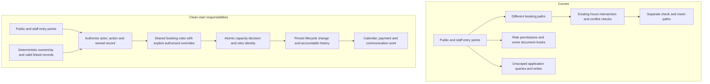

# Phase 2 — Platform architecture and shared-site safety

Source baseline: `4d450ffe4c36270d55c406d5d29531e81da29c31`.
See [evidence-index.md](evidence-index.md) for recorded probes, test results,
source references and limitations. This assessment changes documentation only.

## Compatibility constraint

There are no real customers or customer data. Existing seed/demo/test data need
not survive product changes. Prefer a fresh schema/site and regenerated fixtures
over compatibility scaffolding when that is simpler. Preserve useful behavior,
not legacy representations; follow the parent README's pre-customer policy.

## Verdict

**The current implementation is unsafe for a shared-site customer beta.** A real
HTTP session for a synthetic customer without staff roles received another
business's appointments and walk-ins through the desk APIs. Standard Frappe list
access for that customer returned 403. This is a demonstrated application access
failure, not merely a missing field or a hypothetical risk.

**The shared-site Frappe direction remains a reasonable, conditionally viable
architecture.** The evidence does not justify a rewrite or prove another platform
would be cheaper. Correct server-side authorization and booking guarantees on the
existing foundation, then verify them. Adding a field or permission hook alone
will not establish safety.

Accepting this phase means accepting its findings and limits, not approving a
release or a detailed implementation design. Continue the remaining assessments
on the isolated synthetic site. A dedicated solo site is not certified safe or
usable by this phase: a customer-to-staff access failure can matter even with one
business, and no complete solo journey was executed.

## Three most serious failure modes

| Failure mode | Evidence level | Consequence |
|---|---|---|
| Unscoped application reads and writes cross business/role boundaries | Customer reads reproduced over HTTP; provider cancellation and reception creation reproduced by direct Python API calls under those users | Customer information disclosure and unauthorized booking changes; before-beta blocker |
| Booking paths do not demonstrate consistent, atomic capacity and lifecycle enforcement | Different source paths inspected; no concurrent race or full constraint-bypass scenario executed | Overlaps, retries or different intake paths may produce inconsistent bookings; before-beta guarantee to verify |
| Ownership resolution and historical accountability are incomplete or unverified | Missing direct organization fields on some records; several track_changes settings disabled; export not executed | Difficult authorization, incident reconstruction and later organization separation; ownership and minimum accountability before beta, export tooling when needed |

A supported risk is a plausible failure mechanism in inspected code, not a
reproduced outcome. Unverified behavior is neither a pass nor a failure.

## What the isolation probe actually established

| Persona and method | Recorded result | Limit of the claim |
|---|---|---|
| Provider associated with A; permission-aware Python list | B's Appointment, Walk In, Service, Provider and Location visible; another user's private Booking Event appears in list results | Not every document-read/export path tested. Organization list was denied for this Provider. |
| Provider A; direct `desk.update_appointment` call | B appointment changed to Cancelled; modified_by is A's user | Persisted mutation reproduced; not separately replayed through HTTP middleware. |
| Reception role, not assigned to an organization; direct API | Appointment created using B service/provider/location; Service created without organization | Shows missing restriction for this role/account, not a tested membership transition from A to B. |
| Website customer with All/Guest only; HTTP login session | Desk appointment and walk-in endpoints returned 200 and B record identifiers; `frappe.client.get_list(Appointment)` returned 403 | Customer read exposure demonstrated. Customer writes and anonymous Guest access were not tested. |
| Organization Manager role, not assigned to either organization; Python checks | Organizations A/B listed; B write permission and DocType export permission returned true | Actual organization write and export were not performed. |

Source corroboration: `appointment/scheduler/api/desk.py:20-85` reads via
`frappe.get_all` without role/organization checks; `:435-537` updates a fetched
record and saves with `ignore_permissions=True`. The response decorator in
`appointment/helpers/overrides.py` only maps HTTP status. The permission-aware
customer list denial establishes a role restriction, not a working tenant filter
for staff. The probe does not prove every role can mutate every record category.

## Current versus clean-start architecture

Keep useful Service/EventType binding, layered availability, statuses, walk-ins
and existing integration helpers. The target describes responsibilities, not a
requirement for one database column on every child, one timezone for every
business, or a new framework around every integration.

## Five material findings and actions, ordered by risk

### F1. Application authorization permits demonstrated cross-business access

- **Why it matters:** The confirmed customer read exposure is enough to block
  shared-site customer launch. Recorded staff mutations increase the impact.
- **Evidence:** `P2-PROBE-ISO-01`; `desk.py:20-85,435-537`;
  `appointment/api/manage.py:880-901`; role metadata in inventory output;
  `appointment/hooks.py:190-196` contains a Booking Event document permission
  hook but no active app list-query hook in that section.
- **Action: improve now.** Establish deterministic ownership and enforce actor,
  membership, permitted action and linked-record scope on every relevant entry
  point. Standard list/document permissions and custom APIs both need coverage;
  `permission_query_conditions` cannot scope `get_all` automatically. Check
  public response fields separately from staff access. Avoid leaking records in
  conflict/error responses. Add focused positive and negative permission tests.
- **Timing:** before customer beta. Files, exports, search, realtime, caches and
  jobs remain verification requirements, not proven leaks in this report.

### F2. Booking consistency and atomic capacity are not established

- **Why it matters:** A correct slot display is insufficient if submission,
  retries, rescheduling or another booking channel can violate the rules.
- **Evidence:** `appointment/scheduler/availability.py:21-68` implements the
  intersection; `appointment/api/personal_meet.py:319-442` applies filters in
  the inspected single-provider read path, while `:1316-1463` assembles the
  organization path differently. `appointment/scheduler/api/desk.py:369-418`
  checks conflicts then inserts; `:435-537` supports direct field/status updates.
  `appointment/scheduler/helpers/slot_engine.py:68-145` checks Appointment and
  Booking Event, but Appointment filtering includes both provider and location.
  The controller at `appointment/scheduler/doctype/appointment/appointment.py:10`
  adds no validation. No atomic reservation was demonstrated.
- **Action: improve now.** Define common write-time invariants and explicit,
  authorized staff overrides. Confirm cancellation and rescheduling policies
  cannot be bypassed through generic updates. Serialize/check overlapping capacity
  inside a transaction, across both record types and every relevant write path;
  verify rollback, concurrent requests and scoped idempotent retries.
- **Timing:** before customer beta for supported booking paths. Do not require a
  single rewritten calculator before proving the existing paths can be aligned.

An exact unique key on `(provider, location, start, end)` is **not** an overlap
solution: 09:00–09:30 and 09:15–09:45 have different keys. It also separates the
same provider at different locations. Choose a lock/reservation strategy around
the actual scarce capacity, with a transactionally consistent overlap decision.
Staff booking outside normal public hours may be intentional; define and test
that policy rather than treating every path difference as a defect. No race was
executed in this phase.

### F3. Ownership and accountability need a deliberate contract

- **Why it matters:** Authorization and later enterprise separation need a
  reliable way to identify one business's records and relationships. Support
  also needs an adequate record of material booking and access changes.
- **Evidence:** `P2-PROBE-META-01`: Appointment, Walk In and Booking Event lack
  direct organization fields; Appointment/Organization/Provider/Service/Location/
  Walk In have `track_changes=0`, while Booking Event has `track_changes=1`.
  Current provider membership and linked-record structures exist; export was not
  attempted. Creation/modified metadata is not a complete change history.
- **Action: improve now.** Define unambiguous direct or enforced inherited
  ownership, including legitimate shared-user/provider relationships. Reject inconsistent linked organizations and prevent unintended ownerless
  records in the target model. No backfill of current seed/demo records is
  required: use a fresh schema/site and recreate valid synthetic fixtures when
  simpler than adapting existing data. Define essential history and check
  every write path; enabling track_changes alone does not guarantee complete audit.
- **Timing:** ownership and essential accountability before beta. A documented
  export dependency closure and restore verification are required before offering
  enterprise migration; full export tooling need not block a shared-site beta.

Global identifiers and indirect links do not inherently prevent safe export.
No executed export proves either success or failure here. Tenant-specific
indexes should follow query shape and representative measurements, not an
untested prescription. Duplicate JSON definitions still warrant cleanup review:
one database column was observed per inspected field, but metadata/rendering and
migration effects were not demonstrated to be harmless.

### F4. Time interpretation needs validation; Ethiopian presentation exists

- **Why it matters:** Storage, conflict checks, business-local schedules and
  customer presentation must agree on the same appointment instant.
- **Evidence:** `slot_engine.py:46-65,155-174` uses the site timezone and strips
  timezone information for comparisons. `desk.py:39-43` and policy helpers use
  the site zone. The live organization page imports DateTimeSelector at
  `frontend/src/pages/organization-appointment/index.tsx:28`; its TimeSlotsPanel
  imports/calls `formatEthiopianTime` at `:16,43-48`, using
  `frontend/src/pages/booking-v2/utils/ethiopianTime.ts:26-28` browser-local hours.
- **Action: improve now.** Define conversion/storage boundaries, preserve the
  appropriate business/location IANA timezone, and test a customer browser in a
  different zone plus DST boundaries when supported. Preserve working Ethiopian
  presentation; an unused Python formatter is not evidence the feature is absent.
- **Timing:** consistent instants/display before beta. Additional business zones
  may be deferred only by explicit launch scope; even an Addis-based business can
  have customers browsing from another timezone. Absence of `pytz.normalize`
  alone does not prove a DST defect. No timezone failure was executed here.

### F5. Integration reliability remains unverified, not wholly absent

- **Why it matters:** Advertised integrations need scoped, observable outcomes,
  including retries and duplicates, rather than merely successful booking saves.
- **Evidence:** payments/channels packages have no reviewed implementation, but
  calendar/Zoom helpers exist. `appointment/overrides/event_override.py:168-179`
  enqueues mail after commit; later error handling logs failures. Framework job
  and email facilities exist. Their reliability was not exercised with the QA
  scheduler paused and email muted.
- **Action: improve now when delivering each integration.** Build on existing
  Frappe facilities where suitable; define delivery state, deduplication, retry
  ownership, permission scope and visible recovery. No evidence establishes a
  need to replace the job system or introduce another messaging platform.
- **Timing:** before offering each integration. Retain marketing aspirations and
  use Phase 1's delivery requirements; an unpaid beta is an owner decision, not
  an exclusion silently approved here. Appointment-only request idempotency
  remains part of F2 regardless of payment scope.

## Additional source observations, not extra architecture prescriptions

- `Front Desk` and `Front-Desk` coexist; Appointment DocPerm uses the latter.
  Membership and policy checks also differ. Treat this as part of F1: verify
  intended delegation and action-specific rights before changing role names.
- A frontend route or action-code map being discoverable is not itself an
  authorization vulnerability. Server-side access is the security boundary;
  appropriate UI visibility is a later usability question.
- Source suggests offline API inconsistencies; no offline journey was executed.
  Assess that surface if it is reachable/offered, without expanding this phase
  into repair work.

## Strengths to preserve

- EventType's service/provider/location binding and overrides.
- Existing location/service/provider availability intersection and buffer fields.
- Appointment statuses and the walk-in assignment concept.
- Checks that consider both Appointment and Booking Event, plus Policy calculations.
- English/Amharic presentation and existing calendar/mail integration facilities.

## Remaining coverage and decisions

The tests establish the named administrator-level cases, not full journeys or
isolation: scheduling ran 8 tests successfully; identity ran 18 total, with
17 passing and 1 skipped. HTTP probes support access findings without requiring
a browser replay. No browser UX, concurrent race, DST, export/import, payment
callback or integration failure test was executed.

File access, realtime, search/export implementations, caches, background-job
ownership, capacity at scale and migration/rollback behavior were not
comprehensively audited. They remain release verification work. This assessment
is sufficient to reject current shared-site readiness, not to certify all risks
or prove the listed actions exhaustive. The next UX phase can proceed safely
with synthetic data in the preserved isolated environment.

Owner decisions: first customer workflow and actual launch promises; supported
business/customer timezone combinations; integration delivery order. These
choices prioritize work but do not waive isolation, correct capacity or basic
customer/staff authorization for the offered workflows.
