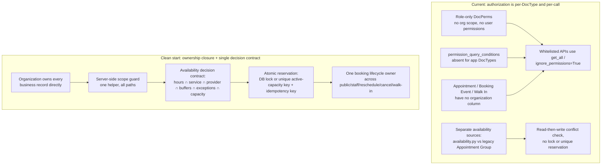

# Phase 2 — Platform architecture and shared-site safety

Baseline: `4d450ffe4c36270d55c406d5d29531e81da29c31` (`origin/develop`, Phase 1 and
`browser-qa-access.md` merged). Assessment branch:
`review/phase-02-platform-architecture`. Loaded runtime package:
`/home/minte/projects/training-apps/.worktrees/frappe-appointment-beta/appointment`
— same commit as this evidence checkout, so source and runtime match at the
baseline (see [evidence-index.md](evidence-index.md)).

This is a platform-architecture assessment. It does not implement fixes, redesign
screens, or certify completed user journeys. Source reads are qualified where
they must be confirmed by execution; executed probes and tests are listed in the
evidence index.

## Verdict

**The shared-site approach is unsound as currently implemented.** Cross-tenant
reads and writes are reproducible through the app's own permission model and its
front-desk APIs. Evidence confidence: **high** for tenant isolation (reproduced
on the isolated site); **medium** for concurrent-capacity and rule-consistency
(source-supported, no race executed); **unverified** for payments, SMS, and
calendar boundary behaviour (no integration exists to test).

The single-site Frappe direction itself is recoverable and is the least expensive
safe path. It becomes *conditionally sound* only when all five conditions below
hold; none is a rewrite:

1. Every business record category has an explicit organization owner, including
   records reached indirectly (appointments, booking events, walk-ins).
2. Server-side scoping is enforced on every read and write path — not only on the
   standard Desk UI — including the front-desk, management, offline, and gateway
   APIs, reports, exports, search, and file access.
3. Public, personal, reception, rescheduling, cancellation, and walk-in paths use
   one authoritative availability and lifecycle rule set.
4. Capacity reservation is atomic and booking requests are idempotent.
5. A single timezone source of truth is honoured outside Africa/Addis_Ababa, and
   core records carry an audit trail.

A solo user on a dedicated account is usable today; the failure is specifically
about many tenants sharing one site.

## The three most serious failure modes

| # | Failure mode | Type | Consequence |
|---|---|---|---|
| 1 | Any tenant's staff role (Provider, Front-Desk, Organization Manager) — and any authenticated Website User through the front-desk APIs — can read and modify other tenants' appointments, walk-ins, services, providers, locations, organizations, and booking events. | **Reproduced defect** | Total tenant isolation failure; PII disclosure and cross-tenant data mutation. |
| 2 | Booking capacity and lifecycle rules diverge across paths and are enforced with a non-atomic read-then-write check. | **Supported risk** | Double-booking under concurrency; reception/organization paths ignore opening hours and buffers that the public single-provider path enforces. |
| 3 | Core records have no organization ownership column and no change history, so a later dedicated-site move cannot be scoped or audited without reconstructing ownership from indirect links. | **Supported risk / unverified export** | Enterprise separation is fragile; safe export/import requirements are not satisfied by the current model. |

Reproduced means observed through an executed probe on the isolated site (see
`probes/outputs/phase02_isolation_probe.txt`). Supported risk means the mechanism
is present in source and would fail under the stated condition, but the condition
was not exercised. Unverified means no evidence was produced either way.

Failure mode 1, reproduced in one probe run (probe run `P2-PROBE-ISO-01`):

- Provider of tenant A: `frappe.get_list("Appointment")` returns tenant A **and**
  tenant B appointments (`APT-P2ISO-A`, `APT-P2ISO-B`).
- Provider of tenant A: `desk.update_appointment(tenant_B_appointment,
  status="Cancelled")` succeeds; `modified_by` becomes tenant A's user.
- Front-Desk of tenant A: `desk.create_desk_appointment(...)` creates an
  appointment for tenant B's service/provider/location.
- Front-Desk of tenant A: `manage.create_service(service_name=...)` with no
  organization succeeds (unguarded write).
- Customer with **no staff role**: after logging into the site,
  `GET /api/method/appointment.scheduler.api.desk.get_desk_appointments` returns
  HTTP 200 with tenant B's appointment, and `.../get_walk_ins` returns tenant B's
  walk-in — while the permission-aware
  `GET /api/method/frappe.client.get_list?doctype=Appointment` correctly returns
  HTTP 403. The tenant boundary exists in Frappe's permission layer but is bypassed
  by the app's own whitelisted endpoints.
- Organization Manager of tenant A: can list, write, and export all
  organizations, including tenant B's.

## Current versus clean-start architecture

The difference is not the entity list; it is where authorization and the
authoritative booking decision live.

The clean-start model keeps the working assets (EventType binding, the
location/service/provider intersection, the Desk API, statuses, walk-ins,
buffers, Policy math) and adds the missing ownership and decision contracts.
It does not require microservices or a new application.

## Material findings

Format: **Finding / Why it matters / Evidence / Action / Timing.**

### 1. Tenant isolation is not implemented at the data or permission layer

- **Finding:** Core business records have no organization owner and no user
  permissions, and the app's APIs bypass the permission layer, so one tenant's
  staff can read and write another tenant's records.
- **Why it matters:** This is the defining shared-site safety property. Its
  failure exposes customer PII and lets one business alter another's bookings,
  services, and configuration.
- **Evidence:** `appointment/scheduler/doctype/appointment/appointment.json:151-188`
  (Provider/Front-Desk role perms only; no `if_owner`, no organization field);
  `appointment/scheduler/doctype/booking_event/booking_event.json:306-330`
  (`All` role read/write); `appointment/hooks.py:190-196`
  (`permission_query_conditions` absent; only `Booking Event` has `has_permission`);
  `appointment/appointment/doctype/organization/organization.json:241-265`
  (Organization Manager role unscoped); `appointment/scheduler/api/desk.py:75,418,473,537,571,624,662,737,867,872,900,919,938`
  (`frappe.get_all` reads and `ignore_permissions=True` writes with no org guard
  and no role guard). Reproduced by `P2-PROBE-ISO-01`
  (`probes/outputs/phase02_isolation_probe.txt`). No `User Permission` rows exist
  (`P2-PROBE-INV-01`).
- **Action:** Improve now — add explicit organization ownership and enforce it
  server-side on every path (see transition step 1). **Timing:** before beta.

### 2. Booking constraints are not shared across paths, and capacity is not atomic

- **Finding:** The single-provider public slot path intersects location/service/
  provider hours and applies buffers; the organization public path and the
  front-desk path do not use the same rules; and all write paths use a
  read-then-write conflict check with no lock, unique constraint, or idempotency.
- **Why it matters:** Two realistic bookings can take the same capacity, and
  reception/org bookings can be created outside the hours and buffers the public
  calendar enforces, producing inconsistent availability and no-shows.
- **Evidence:** `appointment/scheduler/availability.py:21-68` (intersection exists);
  `appointment/scheduler/helpers/slot_engine.py:16-145` (`check_conflicts`,
  no locking), `:177-304` (buffer/working-hour filters only used by callers);
  `appointment/api/personal_meet.py:319-442` (single path applies
  `filter_by_working_hours`, `filter_by_time_off`, `apply_buffer_times`,
  `check_conflicts`), `:1316-1463` (multi-provider path merges legacy slots and
  `mark_booked_slots`, no working-hour/buffer filters); `:455-717`
  (`book_time_slot` checks conflicts then inserts with `ignore_permissions=True`);
  `appointment/scheduler/api/desk.py:369-418,519-537,606-624,809-867`
  (conflict check only; no hours/buffers/notice; `ignore_permissions=True`);
  `appointment/appointment/doctype/appointment_group/appointment_group.py:140-161`
  (write validation against the legacy Appointment Group slots);
  `probes/outputs/phase02_metadata_probe.txt` and the isolation probe show no
  unique reservation key. No `SELECT ... FOR UPDATE`, advisory lock, or
  idempotency key exists (`recon`, section B).
- **Action:** Improve now — one evaluator for availability/lifecycle plus an
  atomic reservation and idempotency key. **Timing:** before beta.

### 3. Enterprise separation is not currently exportable or auditable

- **Finding:** `Appointment`, `Booking Event`, and `Walk In` carry no organization
  column; `Appointment`, `Organization`, `Provider`, `Service`, `Location`, and
  `Walk In` have `track_changes=0`; ownership is only inferable through a chain of
  links, and users/slugs/identifiers are global.
- **Why it matters:** A dedicated site for one organization needs its full
  ownership closure, history, files, and identifiers. Today that would require
  reconstructing ownership heuristically and would risk cross-tenant bleed.
- **Evidence:** `appointment.json` field list (`P2-PROBE-META-01`), `:151-194`;
  metadata probe (`track_changes=0`); `appointment/scheduler/doctype/booking_event/booking_event.json:10-48,295-341`;
  `appointment/helpers/utils.py` and the naming rules (`EVT-.YYYY.-.######`,
  `SRV-.YYYY.-.####`, `BEV.#####`) plus unique `slug` fields on
  `Organization`/`User Appointment Availability`. `qa/preservation` snapshot code
  and `appointment/qa_preservation.py:131` confirm there is no organization
  partition to snapshot. Not executed: no export attempt (prohibited in-scope).
- **Action:** Improve now as part of ownership closure (step 1); define export
  acceptance later. **Timing:** before beta for ownership; later for export tooling.

### 4. Timezone handling is not coherent outside the default zone

- **Finding:** `Location.timezone`, `Provider.timezone`, and
  `Appointment.custom_time_format` exist, but conflict, slot, desk, and policy
  code all use the single `System Settings.time_zone` (default
  `Africa/Addis_Ababa`); `pytz.localize` is used without DST `normalize`; and the
  Ethiopian-time formatter is dead code.
- **Why it matters:** A tenant in a DST-observing zone can book at the wrong
  wall-clock time, and the Ethiopian-time presentation cannot currently appear.
- **Evidence:** `appointment/scheduler/helpers/slot_engine.py:46-50`;
  `appointment/scheduler/api/desk.py:39-43`;
  `appointment/scheduler/helpers/policy_engine.py:42-47,212-216,302-306,354-358`;
  `appointment/helpers/utils.py:161-232` (`format_ethiopian_time` defined;
  `recon` shows no caller); `appointment/api/personal_meet.py:156-217`
  (`user_timezone_offset` only for display translation in the legacy path).
- **Action:** Improve now — choose one timezone source and thread it through;
  accept temporarily for Addis-only launches. **Timing:** before claiming
  non-Ethiopian timezones; after beta for Addis-only beta.

### 5. Integration boundaries are absent, not merely missing implementations

- **Finding:** `appointment/payments/__init__.py` and `appointment/channels/__init__.py`
  are empty; booking has no payment hold, no callback contract, no idempotency
  key, and no durable work or retry ownership for SMS/email/calendar beyond
  Frappe's generic `frappe.enqueue`.
- **Why it matters:** When payments or messaging are added, callback safety,
  duplicate prevention, retry ownership, and failure visibility must land on a
  boundary that does not exist; building them inside booking logic would repeat
  the current coupling.
- **Evidence:** empty packages; `appointment/overrides/event_override.py:168-179`
  (fire-and-forget email enqueue), `:496-498` (errors only logged);
  `appointment/overrides/leave_application_override.py:17,34`; `recon` section D
  (no payment/SMS code). **Callback safety: unverified** (nothing to test).
- **Action:** Replace later — define an integration boundary when the first
  capability is built; keep the marketing promises as delivery requirements per
  `phase-01-product-and-domain/marketing-delivery-requirements.md`. **Timing:**
  before offering each integration; not a beta blocker for unpaid booking.

### 6. Secondary but real: role and API hygiene defects

- **`Front Desk` vs `Front-Desk`:** DocPerms use `Front-Desk` (hyphen) on
  `appointment/service/provider/location/walk_in/eventtype`; hooks fixtures and
  `provider_delegation.json` use `Front Desk` (space). On the QA site both role
  records exist; the reception persona holds `Front-Desk`. A user granted the
  seeded `Front Desk` spelling receives no appointment permissions.
  Evidence: `hooks.py:142-143`, `fixtures/role.json:36`, `provider_delegation.json:41`,
  DocPerm grep; `P2-PROBE-INV-01`. **Action:** improve now (before beta) — pick one.
- **`Desk User` on `User Appointment Availability`:** duplicated DocPerm grants
  every System User read of all providers' booking links/durations across tenants
  (`user_appointment_availability.json:156,162`). **Action:** improve now.
- **Management APIs ignore `Organization Manager` members:** `manage.py:891-896`
  and siblings check only `org.owner_user != user`, while
  `onboarding.py:48-54` also accepts managers. Conversely
  `policy_manager.py:216-217,338-339,351-352` filter `Organization Manager` by a
  `status` field that does not exist on the child table, so manager policy checks
  can never match. **Action:** improve now (before beta).
- **Offline sync:** `offline.py:171,185` imports a non-existent
  `create_appointment` (offline booking is broken); `:235-236` writes
  non-existent `appointment.date`/`appointment.time`; its
  `frappe.has_permission` checks (`:204,231`) pass for any Provider/Front-Desk
  because ownership is global. **Action:** improve now or disable the path.
- **Gateway / routes:** `gateway.py:393-412` exposes the action map to any
  authenticated user; `frontend/src/route.tsx:47-88` has no role guards, so
  `/reception`, `/admin/dashboard`, and `/settings/*` are URL-reachable by any
  logged-in user. UI hiding is not a control. **Action:** improve now.

## Cross-path booking constraint comparison

| Path | Availability source | Hours/service/provider intersection | Buffers | Conflict check | Atomic | Writes |
|---|---|---|---|---|---|---|
| Public single provider (`book_time_slot`/`get_time_slots`) | legacy Appointment Slot Duration + `availability.py` filters on read | Yes on read | Yes on read | Yes (sequential) | No | Booking Event, `ignore_permissions=True` |
| Public organization (`get_multi_provider_time_slots`) | legacy Appointment Slot Duration only | No | No | Marks booked by exact event match | No | Booking Event |
| Front desk create (`create_desk_appointment`) | none | No | No | Yes (sequential) | No | Appointment, `ignore_permissions=True` |
| Front desk reschedule | `validate_reschedule` policy | No | No | Yes (sequential) | No | Appointment |
| Walk-in assign | none | No | No | Yes (sequential) | No | Appointment + Walk In |
| Cancellation | `validate_cancellation` never called | — | — | — | — | Appointment status only |

## Least expensive safe transition

Do not rewrite. Extend the existing foundation:

1. Add a required `organization` Link to `Appointment`, `Booking Event`, and
   `Walk In`; backfill from `event_type→service/provider/location` and
   `location→organization` in one patch. Add a single
   `require_org_access(user, organization)` helper and a `permission_query_conditions`
   + `has_permission` pair for each app DocType, then call the helper at the top
   of every whitelisted API (desk, manage, onboarding, offline, gateway, policy).
2. Replace read-then-write capacity with an atomic reservation: a lock (or a
   unique key on `(provider, location, start, end)` for active statuses) plus an
   idempotency key on booking requests, so duplicates and races are deterministic.
3. Create one availability/lifecycle evaluator and route all six paths through
   it, keeping `EventType`, `availability.py`, statuses, and buffers as inputs.
4. Make `track_changes` on for core records and add indexes on
   `Appointment(provider, location, appointment_date, status)` and
   `Booking Event(starts_on, ends_on)`.
5. Choose one timezone source; thread it through slots, conflicts, policy, and
   presentation; wire the existing Ethiopian formatter or delete it.

Steps 1–3 are beta blockers; 4–5 make the beta operable at the scale the product
claims. None discards working behaviour.

## Strengths to preserve

- `EventType` binding of Service, Provider, and Location with overrides — a useful
  responsibility, not a defect (`eventtype.json:1-101`).
- The location→service→provider opening-hours intersection in `availability.py`.
- Desk appointment/walk-in statuses and the walk-in assignment concept.
- Buffer and duration/price fields on Service, with provider overrides.
- Policy deposit/cancellation math and the `Appointment` + `Booking Event`
  dual-record conflict check (consolidate lifecycle ownership later, not now).
- Amharic/English resources and the time-format control.

## What Phase 2 established against Phase 1's corrections

- The availability intersection **exists** but only the single-provider public
  path honours it; the organization and front-desk paths do not. Constraint
  plurality is not itself the defect; the missing shared evaluator is.
- The slot engine checks both `Appointment` and `Booking Event`; lifecycle
  synchronization was traced and is not the primary risk — authorization and
  atomicity are.
- `EventType` was preserved as legitimate; no evidence justifies collapsing it.
- No dedicated `Customer` model: for shared-site beta this is acceptable; if
  identity is added it must be organization-scoped, and auto-merging by
  name/email/phone must be forbidden.
- Legacy organization fields and the two Front-Desk spellings were checked at
  runtime; the spelling split has a concrete authorization consequence.
- Duplicate metadata fields create **no** independent database columns — one
  column each is confirmed; the cost is metadata noise only.

## Limits and unresolved

- No browser UI journey was executed in Phase 2; cross-tenant access was proven
  through the real HTTP endpoint with a synthetic session, which is stronger for
  this claim than a UI walk-through. Phase 1's static browser evidence is reused
  with its stated limitations.
- No concurrency race was executed; atomicity is a source-supported risk.
- No export/import was attempted, as required.
- Unresolved for the coordinator: (a) which first customer workflow sets beta
  acceptance, which decides how much of ownership/atomicity must land first;
  (b) whether non-Ethiopian timezones are in the first beta; (c) which
  advertised integration is built first and on what boundary.
