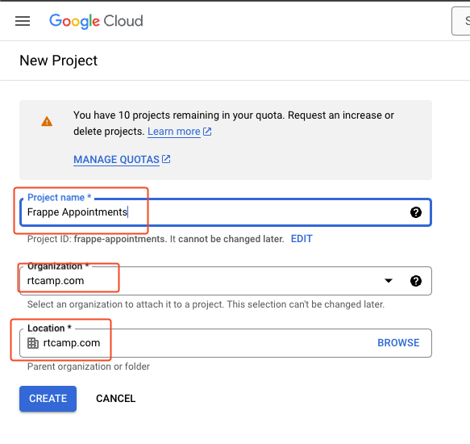
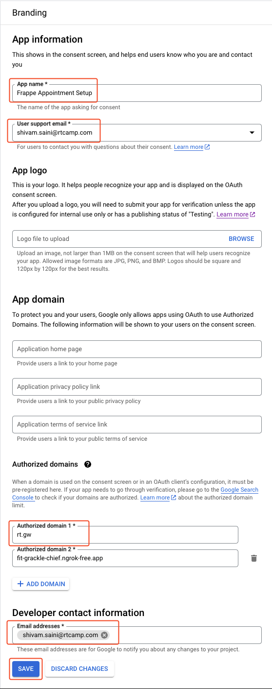
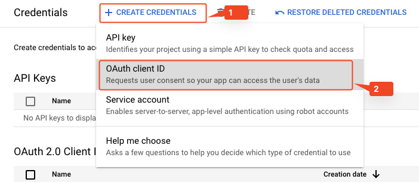
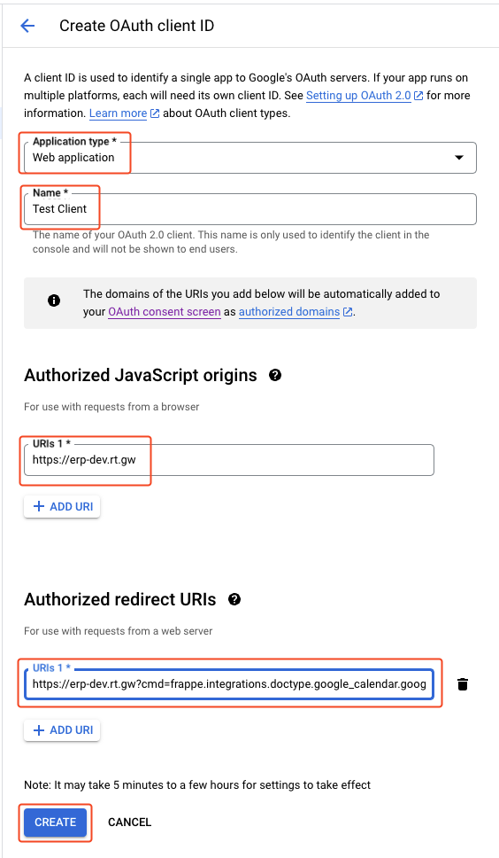
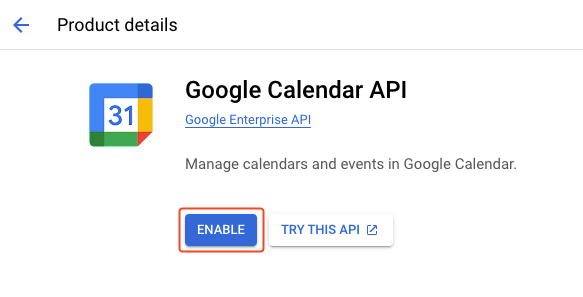
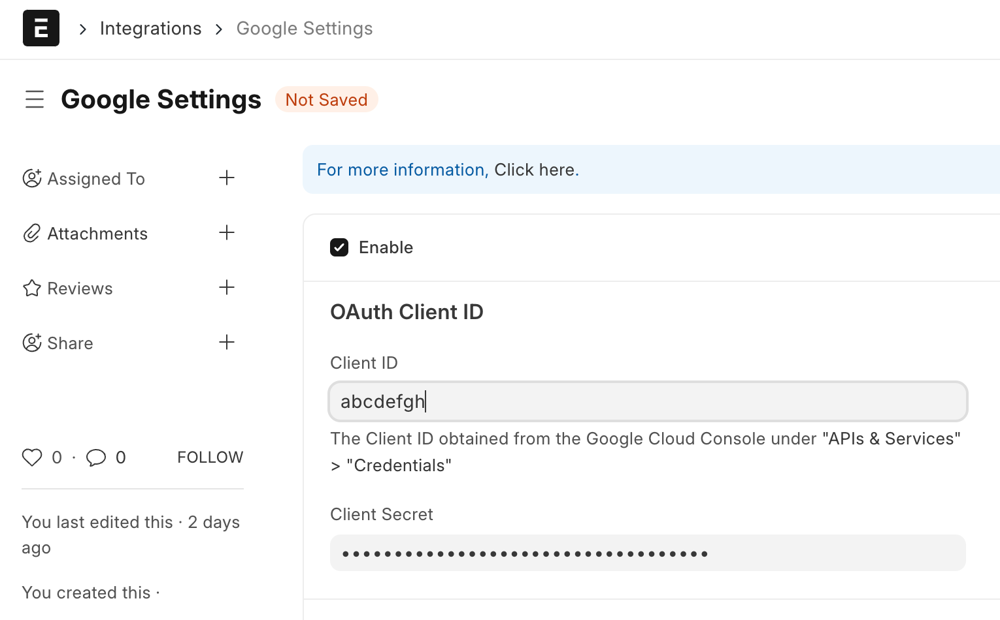

# System Setup Guide

## 1. Google Cloud Setup

### Create a Google Project (If Not Already Created)

1. Visit [Google Cloud Project Creation](https://console.cloud.google.com/projectcreate)
2. Create a project with a suitable name and location



### Set Up Consent Screen

1. Navigate to [Consent Screen Setup](https://console.cloud.google.com/apis/credentials/consent)
2. **Choose User Type:**
   - **Internal:** For organizational use (requires Google Workspace)
   - **External:** Requires app verification due to sensitive scopes
3. Fill out the following:
   - **App Name:** Enter a name for your app
   - **Support Email:** Add your contact email
   - **Authorized Domain:** Provide your app's domain or skip to auto-generate



### Add Required Scopes

1. Click **Add or Remove Scopes**
2. Either include the full `https://www.googleapis.com/auth/calendar` scope or add the following fine-grained scopes:

| API | Scope |
|-----|-------|
| Google Calendar API | `.../auth/calendar.calendarlist.readonly` |
| Google Calendar API | `.../auth/calendar.events.freebusy` |
| Google Calendar API | `.../auth/calendar.events.public.readonly` |
| Google Calendar API | `.../auth/calendar.calendarlist` |
| Google Calendar API | `.../auth/calendar.calendars` |
| Google Calendar API | `.../auth/calendar.calendars.readonly` |
| Google Calendar API | `.../auth/calendar.events` |
| Google Calendar API | `.../auth/calendar.events.owned` |
| Google Calendar API | `.../auth/calendar.events.owned.readonly` |
| Google Calendar API | `.../auth/calendar.events.readonly` |



### Enable Calendar API

1. Visit [Calendar API Marketplace](https://console.cloud.google.com/marketplace/product/google/calendar-json.googleapis.com)
2. Click **Enable**



### Create OAuth Credentials

1. Navigate to [Google API Credentials](https://console.cloud.google.com/apis/credentials)
2. Select **Create Credentials > OAuth Client ID**



3. **Configure:**
   - **Application Type:** Web application
   - **Authorized JavaScript Origins:** Add your Frappe app's base URL (must use HTTPS)
   - **Authorized Redirect URIs:**
     ```
     <BASE_URL>?cmd=frappe.integrations.doctype.google_calendar.google_calendar.google_callback
     ```
     Replace `<BASE_URL>` with your Frappe installation URL, e.g., `https://erp-dev.rt.gw`

4. Save the generated **Client ID** and **Client Secret**

> **Note:** Use the same OAuth credentials for other Frappe integrations like Gmail Threads or Drive.

## 2. Frappe Appointment Setup

### Install the App (using bench)

```bash
bench get-app git@github.com:rtCamp/frappe-appointment.git
bench --site {sitename} install-app frappe_appointment
```

### Configure Google Settings

**Steps:**

1. Log in as **Administrator** in Frappe
2. Navigate to **Google Settings**
3. Enable **Google API**
4. Enter the saved **Client ID** and **Client Secret**



## 3. Zoom Setup

### Setting up Zoom

**Steps:**

1. Go to [https://marketplace.zoom.us/](https://marketplace.zoom.us/), and Sign In with your Workspace Admin Account

2. From the Top-Right, click on **Develop**, and create a **Server to Server OAuth App**

3. Name your App Something. For Example: `Frappe Connect` and create

4. Copy the **App Credentials** (Account ID, Client ID and Client Secret) for later use

5. Click on **Continue**, and fill out **Basic Information** and **Developer Contact Information**

6. Click on **Continue**, We don't need Secret Token, Refresh Token or General Features as of now, so skip this section and click on **Continue**

7. Add the following scopes:
   - `meeting:update:meeting:admin`
   - `meeting:delete:meeting:admin`
   - `meeting:write:meeting:admin`
   - `meeting:update:meeting:master`
   - `meeting:write:meeting:master`
   - `meeting:delete:meeting:master`

8. Now save it

9. Open your Frappe App, Navigate to **Appointment Settings** DocType, and **Enable Zoom**. In the Respective fields add your Zoom Credentials copied in Step 4

10. You're good to go. Ensure that your Zoom Email is set correctly in **Google Account** DocType, and you've a zoom licence that allows you to create and host meetings

---

Created with ❤️ by [rtCamp](https://rtcamp.com)

